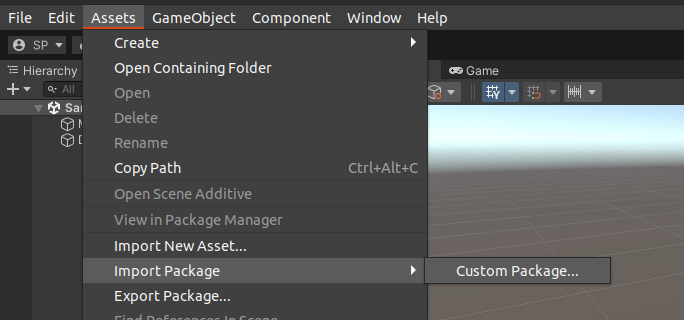
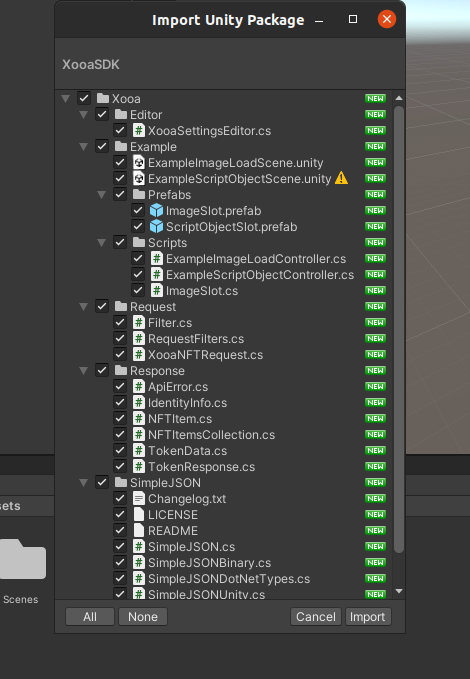
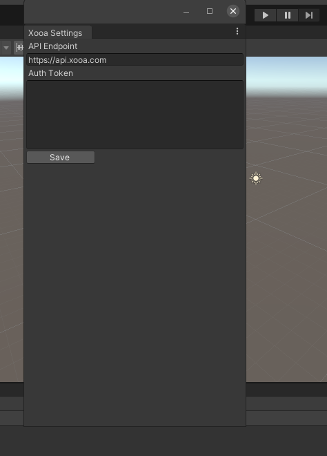

# Xooa Unity SDK

Xooa Unity SDK for integration with Xooa NFT Platform.

Xooa Unity SDK provides capability to fetch NFT details and Assets from Xooa NFT platform. The NFT Assets can be used as in game object as Texture, Scriptable Object or Video link.


## Installation

Download [XooaSDK.unitypackage](./XooaSDK.unitypackage)

Open Or Create Unity project .

Click Assets > Import Package > Custom Package... in the Assets menu.

Select downloaded XooaSDK.unitypackage and Import.

Enter Xooa API token in settings wizard
   Authentication token can be obtained from Xooa Design console API Tab, follow steps given bellow to generate new API token.
       
## Create API Token

Login to [Xooa Design Console](https://xooa.com/blockchain)

Click on Design button of App from App List section

Go to API > Identities and then click Add New

Enter an identity name and under API Access Permission, select Read.

Click Create. You’ll get a message that the identity has been enrolled and the API token generated.

Before you dismiss the message, click Copy, The token is now in the clipboard.

## Example Scenes

Navigate to Assets > Xooa > Example > Example Image Load Scene








## Code
``` 
using Xooa;


RequestFilters filters = new RequestFilters();
filters.AddFilter("type", "ERC-721 Token", "eq");
NFTItemsCollection collections = await XooaNFTRequest.BuildRequest().AddRequestFilters(filters).SetLimit(100).Execute();


await collections.LoadItemsTextures("asset");


foreach (NFTItem item in collections.GetItems()){
    var name = item.GetPropertyKeyValue("name");
    var description =item.GetPropertyKeyValue("description");
    var tokenId = item.GetKeyValue("token_id");
    
    // Your Logic...
} 
