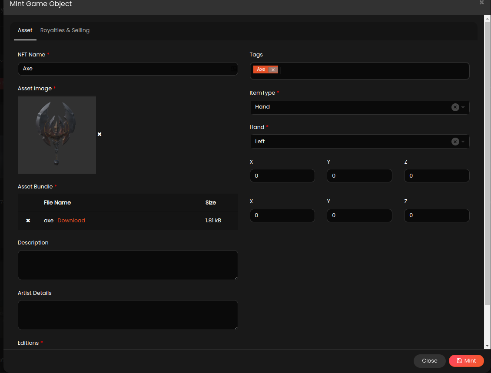

# Using Xooa NFT scriptable object Asset

Login to [Xooa Design Console](https://xooa.com/blockchain) and Deploy Platform minted marketplace app from solution templates if App is not deployed yet.

Once app is ready, click on Design button, go to Forms tab and click on Import

Download sample inventory form [here](./Mint%20Game%20Object.json) then Browse / Drag and drop to file section and click Import.

Setup Page action and Roles permissions to Mint Game object

In Unity Project create Game Object Asset Bundle by clicking on Main Menu > Xooa > Build Asset Bundles, This action will generate Asset bundles in Assets > Xooa > GeneratedAssetBundles folder.

Go to Xooa app runtime console and mint game object with generated asset, refer screenshot below.



Open ExampleScriptObjectController file in unity and replace <USER EMAIL> with actual email of user token is minted.

```
NFTItemsCollection collections = await XooaNFTRequest.BuildRequest()
            .AddEmail("<USER EMAIL>")
            .AddRequestFilters(filters).SetLimit(10).Execute();
```

Run the ExampleScriptObjectScene scene.

Refer to Xooa [API Documentation](https://api.xooa.com/explorer/#!/NFT/NFT_GetAllTokens) for additional fiters.